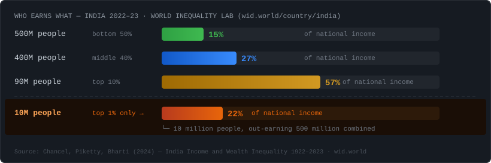

 

 

 

> *To earn the average Indian income, you need to out-earn 90% of India.*
> *Not because the average is high. Because the distribution is that skewed.*

---

## Projects

<table>
<tr>
<td width="50%" valign="top">

### 📊 India: Income, Tax & Where It Goes

Interactive dashboard — income distribution by percentile, who actually pays the taxes, and where central revenue goes.

**[→ View site](https://aina-india.github.io/shape-of-inequality/)** &nbsp; **[→ Code](https://github.com/Aina-India/shape-of-inequality)**

</td>
<td width="50%" valign="top">

### 🪲 RTI Setu

Chrome extension. Describe your issue in plain language → AI drafts the RTI → auto-fills rtionline.gov.in.

No account. No storage. No data leaves your browser.

**[→ Install](#)** &nbsp; **[→ Code](#)**

</td>
</tr>
</table>

---

## Data sources

| Source | What it covers | Release rhythm |
|--------|---------------|----------------|
| [World Inequality Lab](https://wid.world/country/india) | Income & wealth by percentile | Annual |
| [Union Budget](https://indiabudget.gov.in) | Tax composition, receipts, expenditure | Feb 1 every year |
| [Income Tax Dept](https://incometaxindia.gov.in) | Who files, who actually pays income tax | ~18 month lag |
| [PLFS](https://mospi.gov.in) | Employment, labour force, gig economy | Annual (Oct–Nov) |
| [RTI Act 2005](https://rti.gov.in) | The law that makes the rest possible | — |

---

## Philosophy

No opinions. No party. No ideology. If a number is here, the source is cited and the methodology is visible. If something is wrong, open an issue.

The image at the top reflects the current moment. It will change when the moment does.

---

  All data from public sources &nbsp;·&nbsp; No tracking &nbsp;·&nbsp; No ads &nbsp;·&nbsp; <a href="#">Report an error</a>

